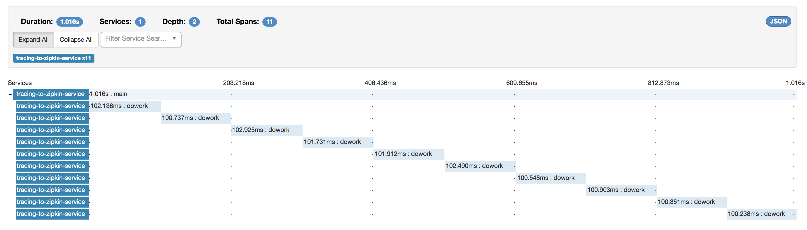

# Introduction
This example shows how to use OpenCensus to trace calls within a single application, and exporting the trace to Zipkin.

## Try it out
1. Download Zipkin: `curl -sSL https://zipkin.io/quickstart.sh | bash -s`
1. Start Zipkin: `java -jar zipkin.jar`
1. Run the code: `mvn compile exec:java -Dexec.mainClass=com.example.TracingToZipkin`
1. Navigate to Zipkin Web UI: `http://localhost:9411`
1. Click *Find Traces*, and you should see a trace.
1. Click into that, and you should see the details.


## How it works?
```java
	public static void main(String[] args) {
		// 1. Configure exporter to export traces to Zipkin.
		ZipkinTraceExporter.createAndRegister("http://localhost:9411/api/v2/spans", "tracing-to-zipkin-service");

		// 2. Configure 100% sample rate, otherwise, few traces will be sampled.
		TraceConfig traceConfig = Tracing.getTraceConfig();
		TraceParams activeTraceParams = traceConfig.getActiveTraceParams();
		traceConfig.updateActiveTraceParams(activeTraceParams.toBuilder().setSampler(Samplers.alwaysSample()).build());

		// 3. Get the global singleton Tracer object.
		Tracer tracer = Tracing.getTracer();

		// 4. Create a scoped span, a scoped span will automatically end when closed.
		// It implements AutoClosable, so it'll be closed when the try block ends.
		try (Scope scope = tracer.spanBuilder("main").startScopedSpan()) {
			System.out.println("About to do some busy work...");
			for (int i = 0; i < 10; i++) {
				doWork(i);
			}
		}

		// 5. Gracefully shutdown the exporter, so that it'll flush queued traces to Zipkin.
		Tracing.getExportComponent().shutdown();
	}
```

OpenCensus can export traces to different distributed tracing stores (such as Zipkin, Jeager, Stackdriver Trace). In (1), we configure OpenCensus to export to Zipkin, which is listening on `localhost` port `9411`, and all of the traces from this program will be associated with a service name `tracing-to-zipkin-service`.

Not all traces are sampled/exported. In production environment, you don't need to sample every single call/request. For demo purposes, to validate that the traces are exported, we'll always sample traces (i.e., export to Zipkin). This is configured in (3), where it grabs the current active parameters (default parameters), and updates the `sampler` parameter.

To start a trace, we first need to get a reference to the `Tracer` (3). It can be retrieved as a global singleton.

To create a span in a trace, we used the `Tracer` to start a new span (4). A span must be closed in order to mark the end of the span. A scoped span (`Scope`) implements `AutoCloseable`, so when used within a `try` block in Java 8, the span will be closed automatically when exiting the `try` block.

Traces are queued up in memory and flushed to the trace store (in this case, Zipkin) periodically, and/or when the buffer is full. In (5), we need to make sure that any buffered traces that had yet been sent are flushed for a graceful shutdown.

